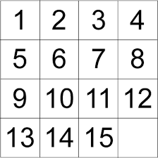

# N-Puzzle

Leon Kosarev 

Version: 6.09.20 

Language: **Python**

Tools: **Pygame**, **NumPy**

## General Description: 

The purpose of the application is to build an interactive N-Puzzle of variable size using a graphical user interface (GUI). In addition, 
various tools such as graph algorithms and heuristics are used in order to find the optimal solution to the puzzle.

## Rules

The puzzle includes a grid of square tiles and a single gap. The player has to rearrange the grid by sliding the tiles until the final configurartion is reached.

**Single move example:**

**Final configuartion:**

&nbsp;&nbsp;&nbsp;&nbsp;&nbsp;&nbsp;&nbsp;&nbsp;&nbsp;&nbsp;&nbsp;&nbsp;&nbsp;&nbsp;&nbsp;&nbsp;&nbsp;&nbsp;&nbsp;&nbsp;&nbsp;&nbsp;&nbsp;&nbsp;&nbsp;&nbsp;&nbsp;&nbsp;&nbsp;&nbsp;&nbsp;&nbsp;&nbsp;&nbsp;&nbsp;&nbsp;&nbsp;&nbsp;&nbsp;&nbsp;&nbsp;&nbsp;

## User Interface

The app includes a graphical user interface (GUI) that allows the user to choose the size of the puzzle, shuffle it, and solve it manually or automatically.

  
### Manual/ Automatic Solving:

 &nbsp;&nbsp;&nbsp;&nbsp;&nbsp;&nbsp;

## Algorithm

When the 'S' key is pressed, the shortest possible solution will be displayed on the screen. The solution is found by applying the **A*** algorithm and using the **Manhattan distance** heuristic.

